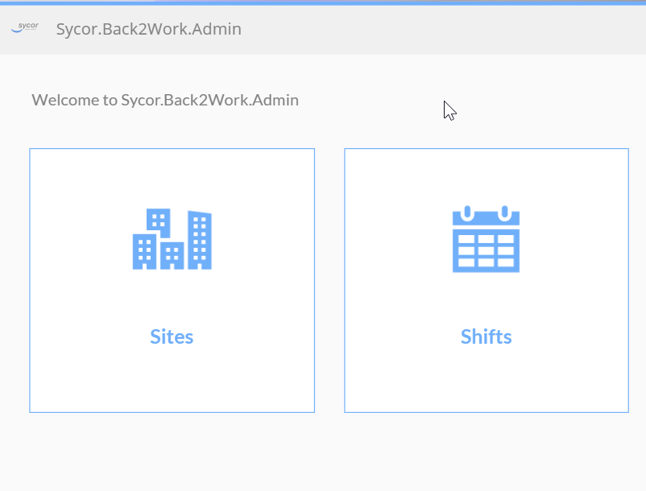
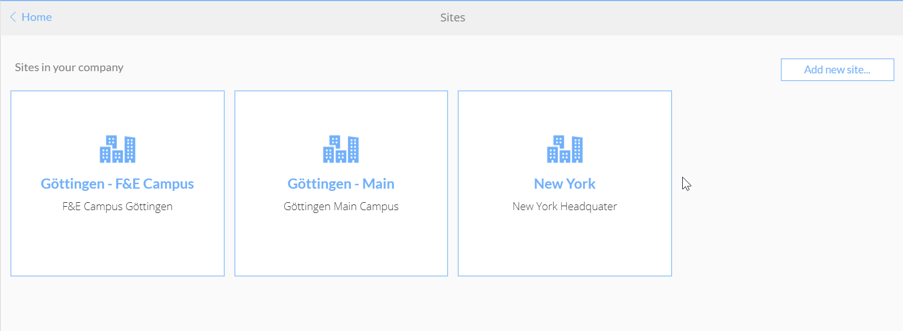
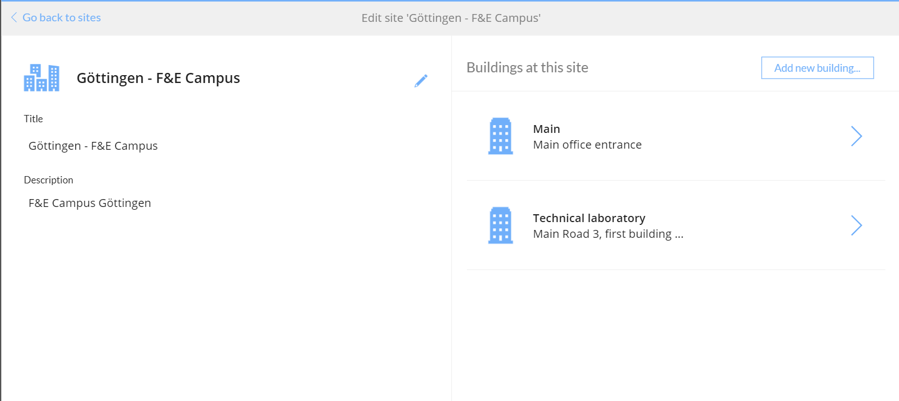
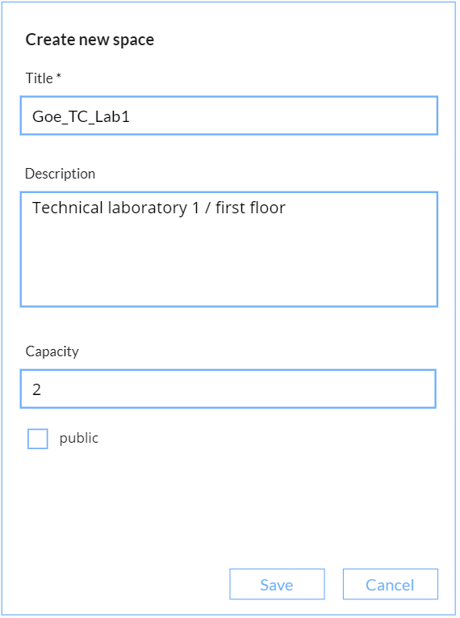
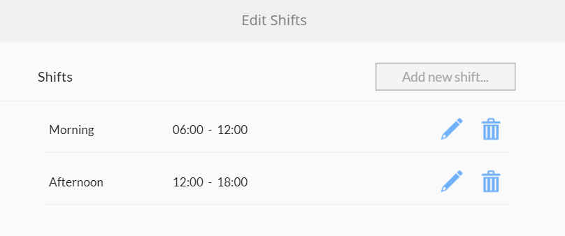

# Configuration
Configuration of this solution means to edit sites, buildings, spaces and shifts. 
## Step by step
1. The configuration app is designed for use as a browser app. Start the administration app from make.powerapps.com. Two tiles are displayed, one for setting up sites and the other tile for shifts. 

2. Choose the tile Sites. You will see all sites already defined in your company. To add a new site just choose "Add new site". For each site you define a title and a description. The title will be shown in drop down fields of the end users app.

3. For definition of buildings on a specific site select a site. Select "Add new building..." to add a new building to a site. Again you can edit a title and a description for each building.

4. Now in each building you can define your spaces. Click on a building and select "Add new space...". You may enter the following information:
* Title: The title of the space - only characters, number and underscores are valid for this field. Please make sure to use unique values because you will use this value for generating scancodes.
* Description: Just an additional description for the space
* Capacity: The maximum capacity of the space. This value is ignored if the checkbox "public" is checked.
* Public: Mark spaces as public when check in / check out should be tracked for this space but is not for reservation.

5. Next define the valid shifts. Navigate to the home screen and select shifts. You can define a maximum of 2 shifts. In this example we defined two shifts, one for morning and one for the afternoon.

## Glossary
### Sites
For this solution we are assuming, that an organisation is located on one or more sites. Mostly sites are the  cities where an organzation is located. However, in some cases organzations are having more than one site in one city. For this reason we prefer the term site rather than city although city might be the appropriate term for most organzations.
### Buildings
Often there is more than one building on one site. For a better selection of spaces we are assigning each working space to a building, not to a site.
### Space
For reservation and check in / check out we are using the term space rather than office. This is because space is more general and it is up to users to define what are the borders of a space. Maybe there are huge offices that are divided into multiple "spaces" you are having the more general term. Space might be configured as public. When the checkbox "public" is checked, no reservations can be made for this space. If you are having a coffee kitchen you may want to define this as "public". So employees may check in to this space but cannot make a reservation.
### Shift
For reservations the system is using shifts (and not start- and end time of planned work). This is because it will be more user friendly to make a reservation for a shift than a cumbersome selection of start and end time. And it will be easier to evaluate which spaces can be reserved. The system allows to define a maximum of 2 shifts.
### Maximum capacity
For each non public space you define a maximum capacity. When the maximum capacity for reservations of one shift is reached, no further reservation for this space is possible.
  