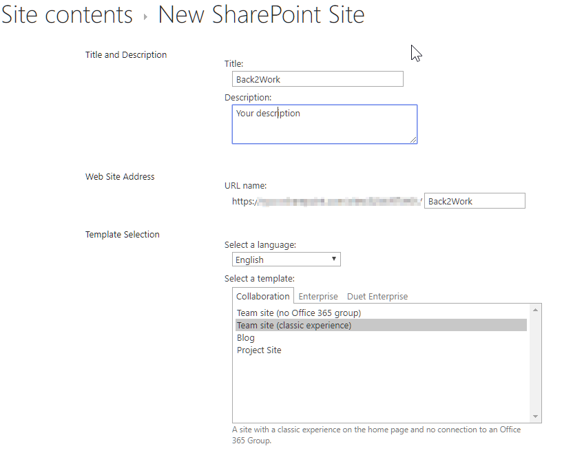
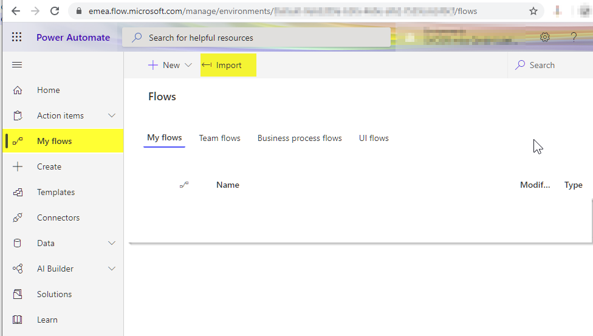
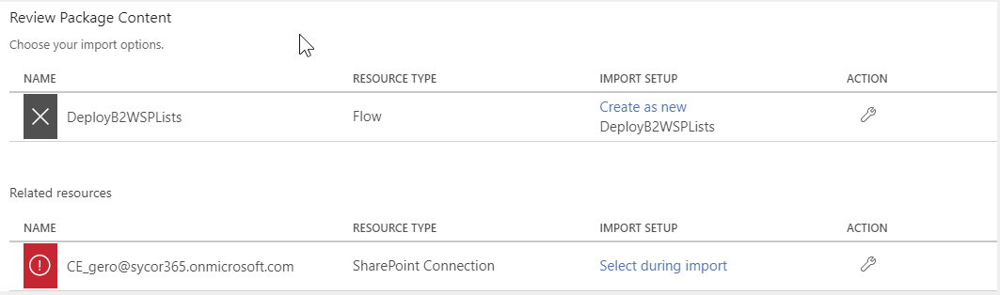
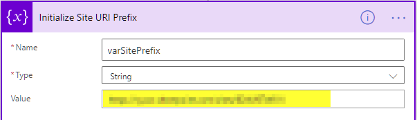

# Deploy all lists

The data backend for this solution is SharePoint. So all lists used by this solution must be stored on a SharePoint site. To help you to deploy all needed lists, we designed a PowerAutomate Flow that is generating all lists for this solution. You can deploy the lists to a site collection or to a subsite. We suggest to deploy the lists to a subsite.

Please keep in mind that this solution was developed and tested using an English language environment. If you try to publish this solution in an environment with another basic  language than English you might adopt the solution according your language.

## Setup a SharePoint site
* Open a SiteCollection where you are having Site Collection Admin privileges 
* Navigate to Site Contents and add a subsite
* Make sure to select English as language. Since no groups are needed, can select "Team site (classic experience)"

* Copy the URL to this site, you will need this later on

## Generate lists
Follow these steps to generate the lists for the data backend of this solution:
* Open  your Office365 PowerAutomate Admin Center (https://emea.flow.microsoft.com/), select the correct environment and navigate to MyFlows and than hit the Import-Button

* Extract the just downloaded file "sycor-back2work.zip"
* Select the just downloaded file "sycor.Back2Work.DeploySPLists.zip" for upload
* Review the package content and make the necessary changes and import the package
	* Choose as import option for the flow object "Create as new"
	* Select or create a SharePoint Connection as SharePoint Site Collection Admin
	

* Now open the flow in edit mode and search for the step "Initialize Site URI Prefix"
* Enter the path to your site in the value field
* Change the connection to your Sharepoint Connection in all 'Connection' Steps (All errors are shown in 'validate flow')

After this you can save and run the flow. Navigate to the site where the assets have been generated and check the site contents. You should see the following lists:
* btw_appConfig
* btw_building
* btw_locationTrack
* btw_reservation
* btw_shift
* btw_site
* btw_space

When the data model was setup completely you may delete this PowerAutomate Flow. It is only for deploying the lists.
