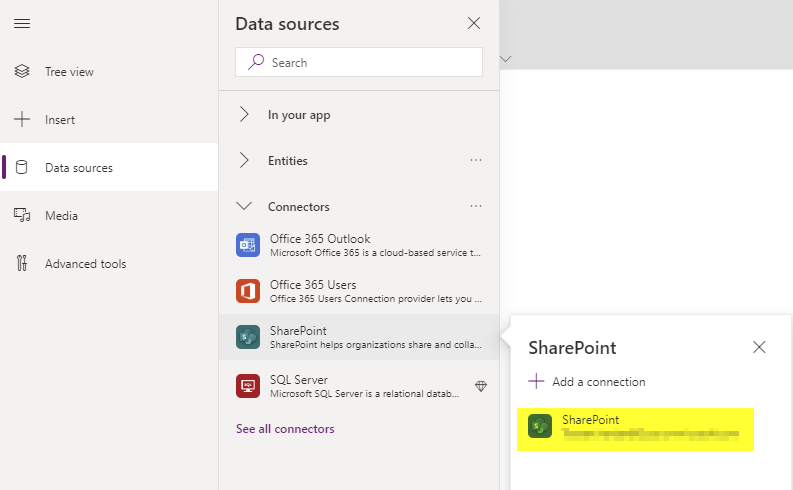

# Install the Admin PowerApp
The Admin App is used to define your company sites, buildings, spaces, shifts and global settings. This is how to setup the Admin App:
1. Open your environment in https://make.powerapps.com, sign in with administrator credentials, navigate to Apps and select "Import Canvas App"

2. Upload the file Sycor.Back2WorkAdmin.zip and hit the import button.
3. Now you have to connect the app with our SharePoint data model. For this task you will have to open the app in PowerApps Studio. On the top of the screen you will find a link to PowerApps Studio. 

4. When opening PowerApps Studio you will first have to grant permissions to SharePoint. Hit the allow button. 

5. Delete the connections to the SharePoint lists btw_appConfig, btw_building, btw_shift, btw_site and btw_space.

6. Open the data sources menu on the left side of the screen and select SharePoint from the Connectors group. 

7. Now enter the URL to the site with our data source and choose the lists btw_appConfig, btw_building, btw_shift, btw_locationTrack, btw_site and btw_space. 

8. Save and publish the app, it is ready to use now.
