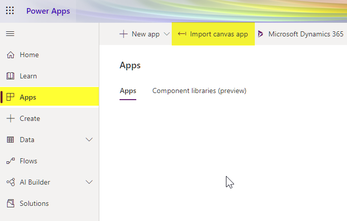
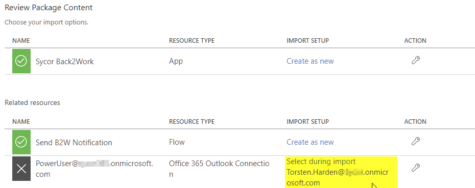
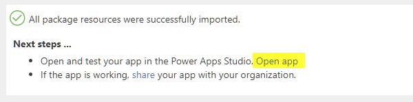
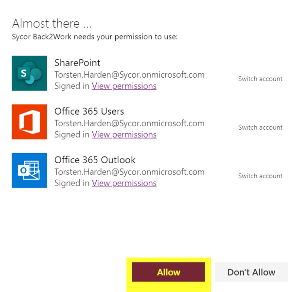
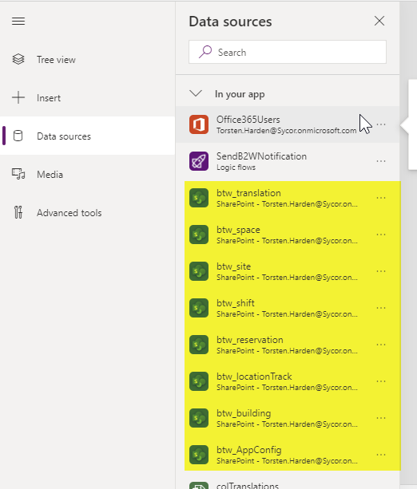
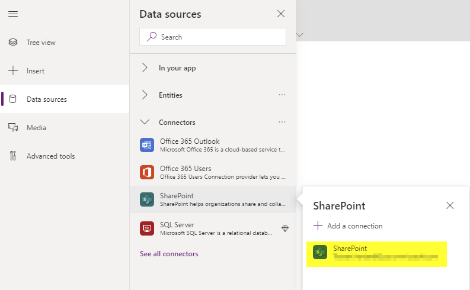
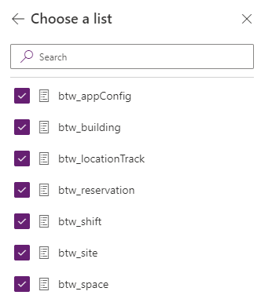
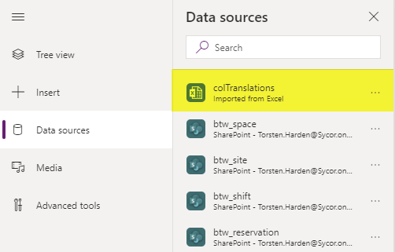
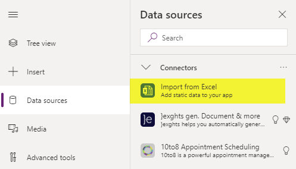
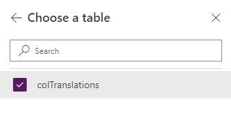

# Install the end user PowerApp
The end user PowerApp is what employees will see on their PowerApp App on their smartphones:
1. Open your environment in https://make.powerapps.com, sign in with administrator credentials, navigate to Apps and select "Import Canvas App"

2. Select a valid Outlook connection for your environment and hit Import 

.

3. Now you have to connect the app with our SharePoint data model. For this task you will have to open the app in PowerApps Studio. On the top of the screen you will find a link to PowerApps Studio. 

4. When opening PowerApps Studio you will first have to grant permissions to SharePoint, Office 365 Users and Office 365 Outlook. Hit the allow button. 

5. Next you navigate to Data Sources and delete the existing links to the sharepoint datasources. These are the following datasources: btw_translation, btw_space, btw_site, btw_shift, btw_reservation, btw_locationTrack, btw_building, btw_AppConfig 

6. Open the data sources menu on the left side of the screen and select SharePoint from the Connectors group. 

7. Now enter the URL to the site with our data source and choose the lists btw_translation, btw_space, btw_site, btw_shift, btw_reservation, btw_locationTrack, btw_building, btw_AppConfig 

8. Next you have to import the current translation. First delete the Data Source colTranslations 

9. Now import the current translation from the Excel file with translations. Navigate to Data Sources and open Excel from the group connectors and open the file Back2Work.Translations.xlsx 

 

10. Choose the table colTranslations and hit the Connect button (the translation file is having translations for German and English, you may add additional languages in this file) 

 

11. Save and publish the app, it is ready to use now.

*Note:* When you are observing errors, try to refresh the data sources or repeat the import procedure.
